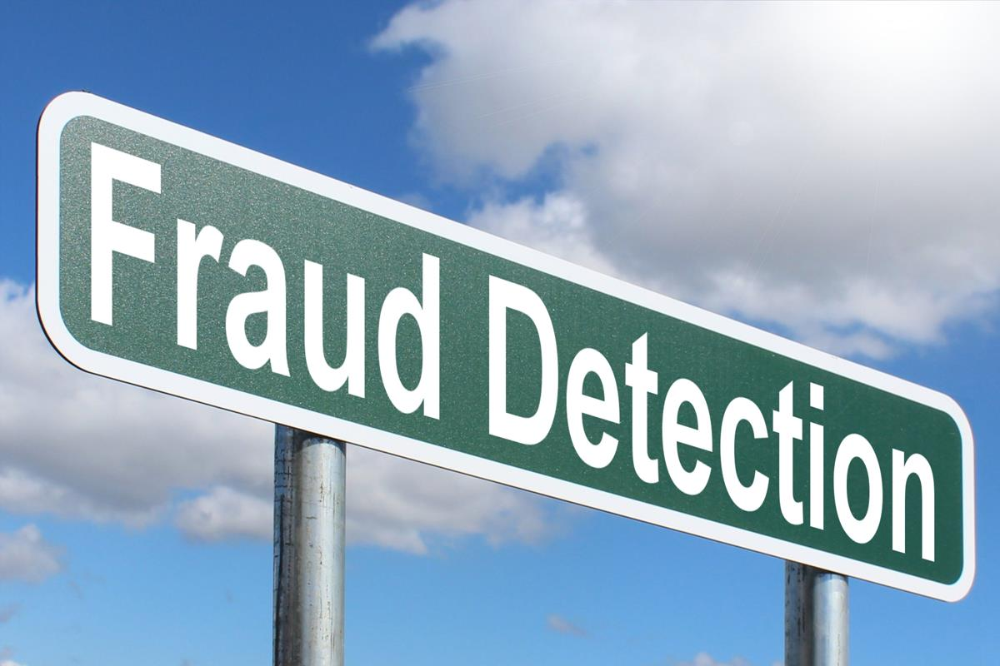

# Fraud Detection

Fraud is omnipresent and manifests itself in a great variety of ways. Analytics is a modern branch of computational methodology that has great promises in the detection of fraudulent behavior, even if one does not yet know how the fraud is committed and hence how it should show. By combining various techniques to look at billing data from any angle imaginable, a thorough detection algorithm can be implemented. A prototype is developed here, based on a mock data set to showcase the type of models that can be implemented and how to combine these in a hybrid detection algorithm. The small working demo of a possible fraud detection algorithm here is designed to catch fraud by service providers such as healthcare providers. *All data is fictional.* For a longer description of the project, see below.

***
**Disclaimer:** This is by no means a complete working example ready to take into production. Rather, it is meant to demonstrate what kind of models can be used for fraud detection and how they can be combined into a hybrid scheme. 

There is no user-friendly GUI, it all just consists of a small library of detection models as well as three notebooks that 1) generate mock data for the example, 2) showcase two of the models in some detail and 3) show the combination of nine models into a hybrid scheme. All three notebooks work separately.
***

A list of contents:
- A library of fraud detection models: models.py
- A notebook describing the (creation of) a mock data set used for fraud detection: Mock_data.ipynb
- A data directory with three versions of the mock data set, generated by Mock_data.ipynb: data/mock_healthcare.*
- Showcases.ipynb has two of the models worked out in some detail, with visuals, to give an idea of what respective fraud detection models can do. These are only two of ten models used in total.
- HybridFraudDetection.ipynb is a notebook that shows how to combine all models into a total fraud risk score. For now this works, but still gives some warnings that need attention, and outbput that needs layout.
- models_explanation.pdf that has a description of all nine fraud detection models in models.py, their options and how their results are combined into one overall fraud risk score.
***

The code is in Python 3.6, but shouldn't be too sensitive to versions. It requires numpy, pandas, matplotlib, scikit-learn and (only for one plot) seaborn and altair.

For questions, comments etc. feel free to contact the author here, or at datascience@marcelhaas.com.

Marcel Haas

***
***
## A modular algorithm for fraud detection

There are a great many ways to financially gain from bending or breaking the rules. No two fraudsters will likely to be the same. Their behavior can manifest itself in plenty of ways, but their behavior is in at least some ways deviant from the general population. It is, therefore, important to mine data for deviant behavior from very many different angles. In the proposed solution it is easy to include new scenarios, even when a whole set of scenarios has already been used successfully. 

The idea is to come up with a list of models that look at the data from any angle imaginable and to “flag” behavior that is either defined to be against the rules, or can hint at outliers (without even knowing what exactly is wrong). Such fraud detection models can raise a red flag based on user-defined criteria, that can be fine-tuned to optimize detection and to minimize false positives. Every detection model can result in a severity score (how much is wrong with this one person or institution in this model) and a monetary score (what is the amount of money related to this risk).

Fraud detection models can come in a wide variety, utilizing techniques of wildly varying complexity. Simple business rules can result in right or wrong decision on certain procedures on the bills of customers (this procedure can not be done together with, or after that other procedures). Such erratic (parts of) bills can be counted and compared to the number of unflagged procedures, so as to formulate a severity as well as a monetary score for such simple detection models. 

One degree more complicated would be to look at certain characteristics of the whole population of either healthcare providers or members and define the common behavior to be the norm. Statistical outlier detection techniques can then be utilized to detect instances that deviate from the norm. A common example would be to look a the distribution of cost per insured member for all providers. In a reasonably complex market (with many different diagnoses and possible treatments) this is likely to result in something like a log-normal distribution function which can used to define formal outliers in that property. 

Outliers can also be found in more-dimensional spaces with various unsupervised machine learning techniques like (density or neighbor-based) clustering, dimension reduction techniques etc. Such segmentation methods can also be used to define reference groups within which similar suspects can be more reliably compared to one another. More sophisticated models could be of a predictive nature, forecasting the amount of revenue, the number of (a certain type of) treatments etc. and to compare these forecasts to the realization. This could potentially flag unrealistically large growth in revenue in a very early stage (so before the bulk of the money has already been paid). 

More advanced techniques can also be used in detection models. For example the social network of previously identified misbehavers could hold clues to newly identified suspects. Neural networks can be used both as an advanced way of reducing dimensionality, as well as in models that try to capture strongly non-linear behavior of predictions as a function of input features. Also in cases where there is a lot of interaction between predictors, (deep) neural networks can still reliably identify behavior that is deviant from the norm.

A list of suspects can then be constructed by properly weighting three ingredients: the total or average severity of all detection models, the total amount of money involved, as well as the number of different models that raise a flag for the instance in question. In conventional fraud detection, where models are checked independent of one another, it is easy to stay under the radar by making sure one does not make all his/her extra money the same way, but by spreading chances over several routes. Often, fraudsters try a few methods and expand a little bit on every lucrative method. This hybrid, multiple scenario approach will make it much easier to catch such instances as well.